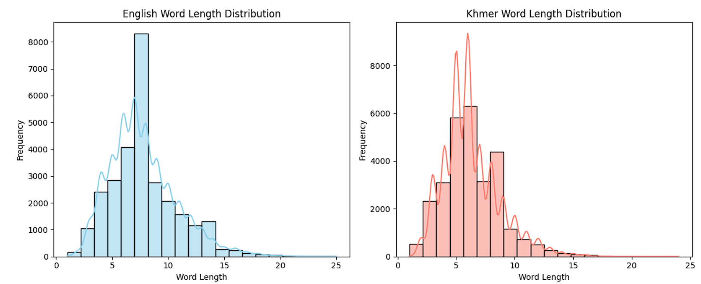
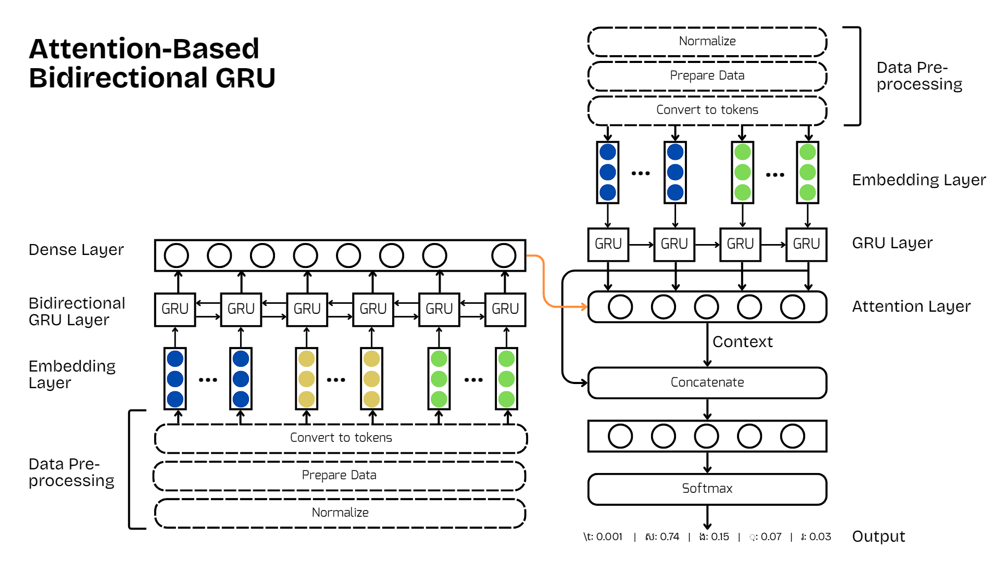
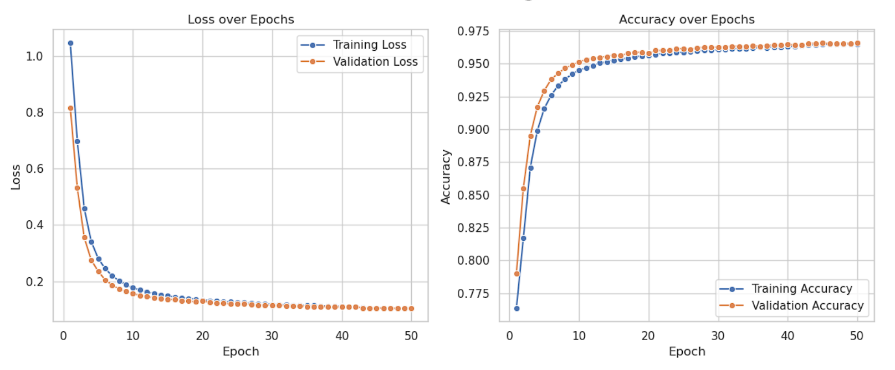
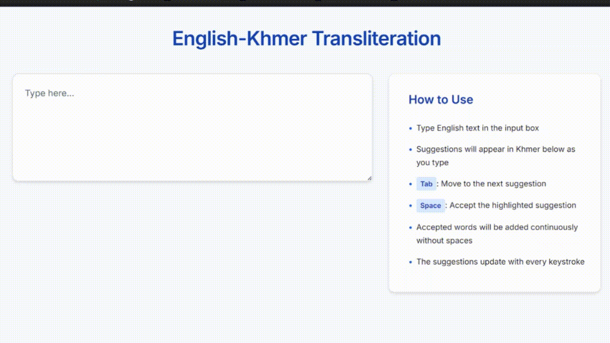

# English–Khmer Transliteration Using Attention-Based Bidirectional GRU

## Overview
An English–Khmer transliteration system built on an Attention-Based Bidirectional GRU architecture. The model automatically converts romanized Khmer text written in the Latin alphabet into its corresponding Khmer script form. To enhance accuracy and ensure linguistic validity, the system incorporates a Khmer dictionary-based post-processing step for proof checking and correction.

## Dataset  
The dataset used in this project was sourced from the [Khmer Text Transliteration Dataset by Chhunneng (2023)](https://github.com/Chhunneng/khmer-text-transliteration), which provides parallel pairs of English–Khmer transliterations for machine learning research.  

There are 77 unique Khmer characters and 26 unique English characters in the dataset. The maximum sequence length for English (romanized Khmer) inputs is 25 characters, while the maximum Khmer output length is 24 characters.



- **Total Samples:** 28,569  
- **Train Set:** 22,855 (80%)  
- **Validation Set:** 5,714 (20%)  
- **Format:** Parallel text pairs (`brodae: ប្រដែ`)

## Model Architecture
The model is based on an Attention-Based Bidirectional GRU architecture designed for sequence-to-sequence transliteration. It follows an encoder–decoder structure, where the encoder processes the input Latin Script (English) sequence, and the decoder generates the corresponding Khmer script sequence character by character.



### Encoder  
The encoder uses a Bidirectional GRU layer to process text from both start and end directions within the input sequence. This allows the model to better understand dependencies across the entire input text, which is particularly useful for transliteration tasks where phonetic relationships depend on both preceding and succeeding characters.  

Each input token is first mapped into a continuous vector space through an embedding layer, which converts discrete character indices into dense embeddings of dimension 32. The bidirectional GRU then encodes these embeddings into a hidden state representation that encapsulates forward and backward context information.  

### Decoder  
The decoder consists of a GRU layer that processes the output sequence one Khmer character at a time. At each decoding step, it receives the previously predicted token and the projected hidden state from the encoder. The attention mechanism then combines the encoder’s output representations with the decoder’s current hidden state to generate a context vector, which helps the model focus on the most relevant parts of the input sequence. This context vector is concatenated with the decoder’s GRU output and passed through a dense softmax layer to produce the final character prediction.

**Embedding Dimension:** 32  
**GRU Units:** 64  
**Attention Mechanism:** Additive Attention  

## Training Configuration
- **Batch Size:** 64  
- **Epochs:** 50  
- **Validation Split:** 20%  
- **Optimizer:** Adam  
- **Loss Function:** Sparse Categorical Crossentropy  
- **Learning Rate Scheduler:** ReduceLROnPlateau (factor=0.5, patience=3)

## Model Performance  
After training the model for 50 epochs, the evaluation metrics indicate strong performance on the transliteration task. The model achieved an **average Character Error Rate (CER)** of **0.1507** and an **average BLEU score** of **0.6871**, reflecting its accuracy in generating Khmer transliterations from English inputs.

At the final epoch (Epoch 50/50), the training process reported the following statistics:

- **Training accuracy:** 0.9648  
- **Training loss:** 0.1033  
- **Validation accuracy:** 0.9659  
- **Validation loss:** 0.1040  
- **Learning rate:** 5.0 × 10⁻⁴  



## Installation
```bash
git clone https://github.com/NDarayut/english-khmer-transliteration.git
cd english-khmer-transliteration
pip install -r requirements.txt
```

## Usage  
## 1. Generate single transliteration  
```python
from inference import transliterate_text

print(transliterate_text(eng_input="brodae", beam_width=3, max_length=32))
# Expected Result: 'ប្រដែ'
```

## 2. Generate multiple transliteration  
```python
from inference import transliterate_top_n

print(transliterate_top_n("brodae", beam_width=5, max_length=32, n=3))
# Expected Result: ['ប្រដែ', 'បរដែ', 'ប្រតែ']
```

## 3. Generate multiple transliteration with correction 
```python
from inference import transliterate_with_dict

print(translitertransliterate_with_dictate("brodae", beam_width=5, max_length=32, n=3, max_distance=2))
# Top Candidates from model: ['ប្រដែ', 'បរដែ', 'ប្រតែ']
# Valid Candidates after filtering: ['ប្រដែ', 'រដែ', 'ប្រែ']
```

## Web Application  
To demonstrate the functionality of this transliteration system, a simple **Flask web application** has been created.  

To run the application:
```bash
python app.py
```

Open your web browser and navigate to:
http://127.0.0.1:5000/


## Demo  


## Citation
> Chhunneng. (2023). *Khmer Text Transliteration Dataset*. GitHub repository.  
> Available at: [https://github.com/Chhunneng/khmer-text-transliteration](https://github.com/Chhunneng/khmer-text-transliteration)
